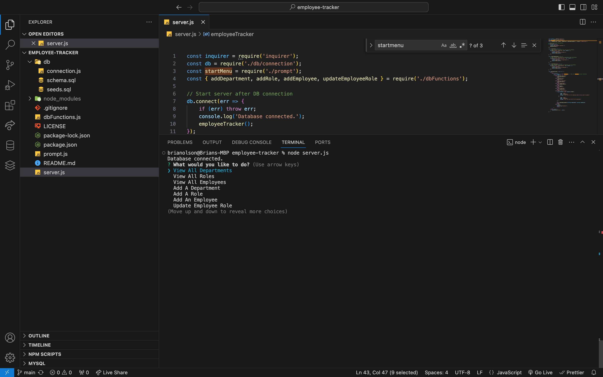

# employee-tracker

## Description 
The Employee Tracker App is designed to make implementing employee managemnet systems easier to operate. By using this program, users will just have to answer the necessary prompts to manage their employees.

## Table of Contents 
- [Installation](#Installation)
- [Usage](#Usage)
- [License](#License)
- [Contributing](#Contributing)
- [Tests](#Tests)
- [Questions](#Questions)

## Installation 
To install this project, please clone the repoository to your local machine and run 'npm install' to install the necessary dependencies. 

## Usage
To use this application, enter node server.js in the command line and answer the prompts. 

## License 
This project is licensed under the MIT License.

## Contributing 
N/A

## Tests
N/A

## Questions
GitHub Profile: [bwolson31](https://github.com/bwolson31)

For additional questions, contact me via email: bwolson31@gmail.com

